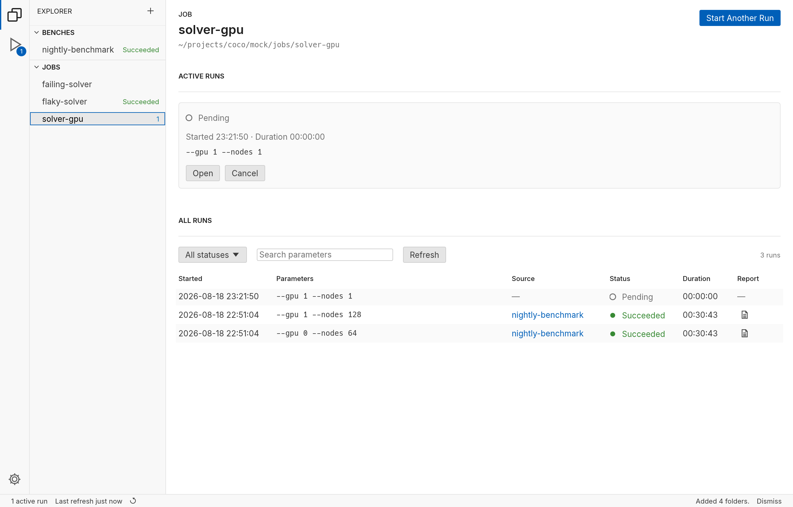

# cocoa

A desktop workbench for experiments that live on your own machine.

An experiment, to cocoa, is a **folder**: a `cocoa.toml` manifest and the scripts
it names. Experiments come in two kinds — **jobs**, launched one run at a time,
and **campaigns**, whose plan fans out over jobs — and *experiment* is the word
for either, here and everywhere cocoa speaks. The manifest says how to check
that what a run needs is in place and deploy it when it is not, how to launch a
run, how to ask whether it is still going, how to produce a report, and how to
cancel it. cocoa runs those scripts.
It does not know what a cluster is, whether you use Slurm, or how you reach it —
your `launch.sh` knows, and cocoa knows only what your script printed.

That is the whole trick. cocoa is not a scheduler, a job queue, or a client for
anything. It is a window onto folders you already have, doing the part that is
tedious to do by hand: remembering what you ran, polling it, collecting the
report, and telling you which of your runs are still alive.

## The folder is the record

cocoa keeps no database. A run is written into the experiment's own folder, as
`runs/<id>/run.json`, and its report lands in `report/`. The convention is
written down in [the convention](../spec/convention/README.md) and both implementations follow
it byte for byte.

This has consequences worth stating plainly, because they are most of the reason
the design is what it is:

- **Your records outlive cocoa.** Delete the app and the runs are still there,
  in a documented JSON format, next to the experiment that produced them.
- **They are ordinary files.** `grep` them, commit them, rsync them, read them
  from a notebook. Nothing is locked inside an application.
- **The folder is portable.** Move it to another machine, register it there, and
  its history comes with it.
- **You can edit them by hand**, and cocoa will notice within a tick.

What cocoa holds in memory is a working copy, rebuilt from those folders and
written back through to them. Nothing important lives only in the app.

## Two kinds of experiment

**A Job** is one runnable experiment. Start it, and it runs. Start it four more
times with different parameters and you have five independent runs — cocoa never
blocks a start because something else is running.

**A Campaign** is a fan-out. It does not contain Jobs and it is not a pipeline.
When you start one, its plan script returns a list of calls to Jobs *that
already exist in your Explorer*, each with its own parameters, and cocoa
dispatches all of them at once. There is no ordering and no dependency between
them. The same Job may appear a dozen times with a dozen parameter sets — a
sweep is what a Campaign is for.

A run dispatched by a Campaign is a **real run of that Job**, stored once and
reachable from both places: from the Campaign's dispatch table, and from the Job's
own history. Same record, different context; the breadcrumbs and the highlighted
Explorer row tell you which way you came.

## What using it looks like

1. **Add a folder.** The `+` in the Explorer opens your operating system's own
   folder picker. One pick is one experiment.
2. **Start a run.** The Start page shows the parameters this experiment's
   manifest declares, empty. A start means *launched*: the run appears the
   moment its script is spawned, before the cluster has said anything.
3. **Watch it.** cocoa polls every three seconds. Statuses move on their own; so
   does the duration.
4. **Read the report.** When the run finishes, cocoa runs the report script and
   shows the result in the window — plain text or HTML, searchable, with a wrap
   toggle and a copy button.
5. **Cancel, if you need to.** Behind a confirmation, and for a Campaign, only the
   runs that Campaign dispatched.

## Two things told apart

Most of the care in cocoa goes into distinctions that are easy to collapse and
expensive to get wrong:

**"Your experiment failed" is not "I could not reach the cluster."** A poll that
times out does not overwrite what the run was last known to be doing. The run
still says `Running`, with the last successful query time beside it and the
reason the query failed. A failure of cocoa's own — a script that will not run, a
launch whose output never arrived — is a third thing again, `ERROR`, never
dressed up as your experiment's verdict.

**A run's report is not its status.** A run can finish and have no report yet;
a failed run can have a very informative one — failure is when you need it
most, so cocoa runs the report script for a failed run too. The report is
where you find out what happened, so it has its own states. cocoa waits to call
a run `Succeeded` until it has one, and a failed run stays `Failed` whatever
its report does: the cluster's verdict is not the report's to change.

## Driven by an agent, too

cocoa answers on a Unix socket while its window is open, and an agent can list
experiments, read runs, and start them through it — the same operations a click
uses, on the same engine, landing on the same screen. Every run records who
asked: **you**, an **agent**, or the **campaign** that dispatched it.

That is what makes it worth giving an agent: the agent works where you can see
it. Its runs appear in your window as it starts them, through the same scripts
you would use, rather than as commands typed into a cluster somewhere you are
not looking. See [working with an agent](agents.md).

## What it is not

- Not a scheduler. Your scripts talk to whatever runs your work.
- Not a build system. Your deploy script builds and copies; cocoa only asks
  your check whether it needs to.
- Not a pipeline or DAG tool. A Campaign fans out; it does not sequence.
- Not a server, and not multi-user. It is one window on one workstation.
- Not a place your data lives. It is a view of folders that were already yours.

## Beside a workflow tool

cocoa does not replace Snakemake, Nextflow, or whatever orders the steps of
your work on the cluster. Those define what depends on what, remotely. cocoa
is the end you sit at: start something, follow its status, read its report
when it is done. The two compose — a job's `launch` can submit a whole
Snakemake workflow, and cocoa follows it as one run.

## Where to read next

| | |
|---|---|
| [authoring.md](authoring.md) | Writing a job or a campaign: the folder, the manifest, the six scripts, and what a report should say |
| [agents.md](agents.md) | Working with an agent: how it reaches cocoa, and the rules it works by |
| [examples/](../../examples/README.md) | A library of small, real experiments to try cocoa against — no cluster needed |

Everything else — what each screen must do, how cocoa is built, the full folder
contract and how to work on it — is the development specification, in
[`../spec/`](../spec/README.md).
